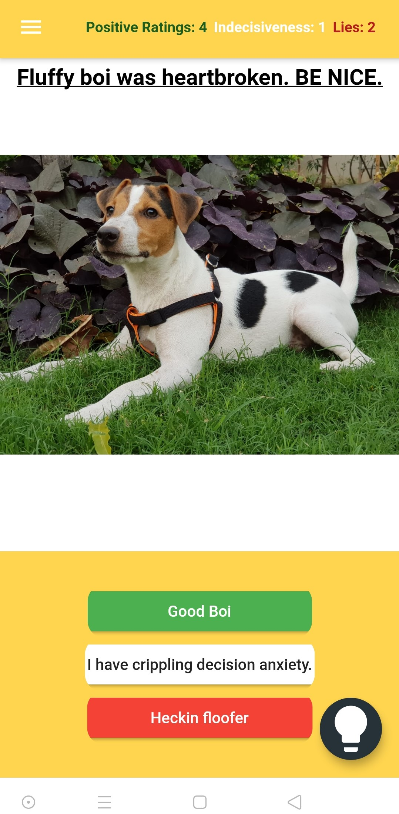
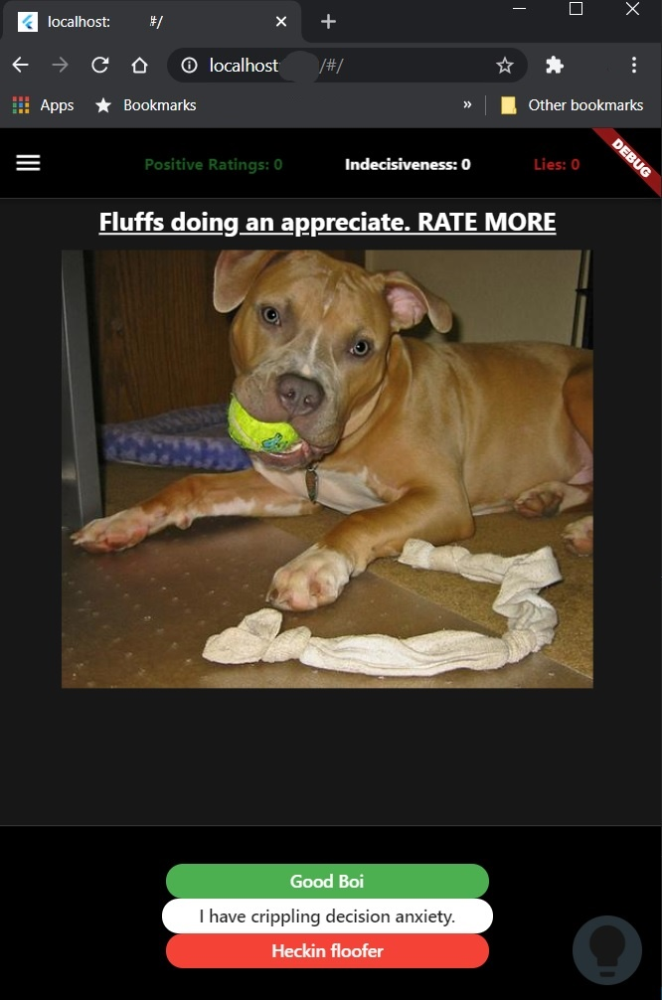
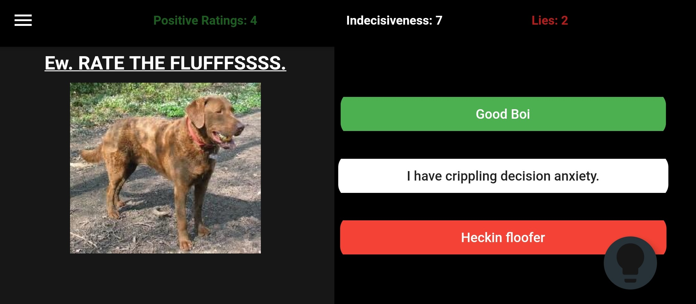
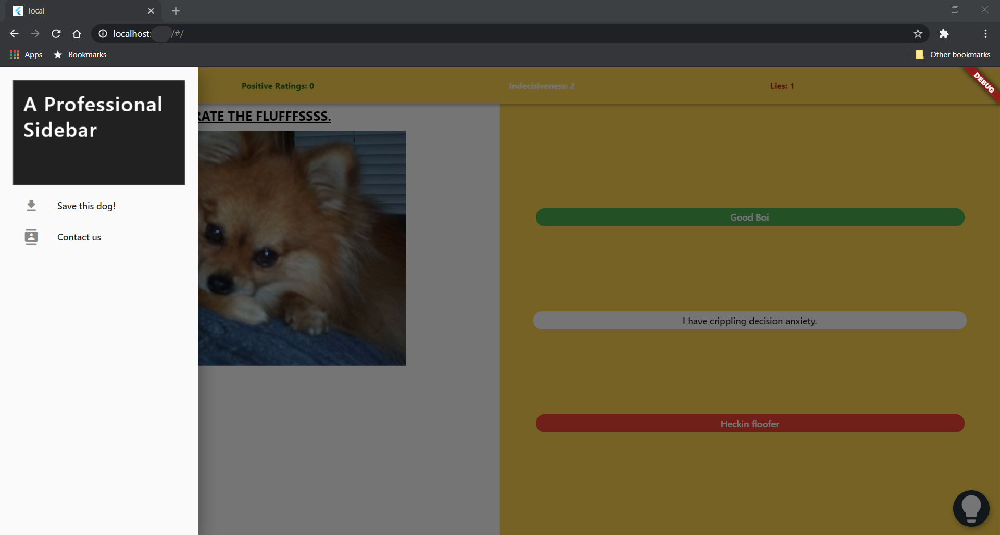

# Doggo Rater:

Get to look at and rate photos of random Dogs from all over the internet.

## ABOUT:

Flutter app that was created by [Dhiman Seal (@dhi13man)](http://www.github.com/dhi13man), just as an excuse to learn the basics of Flutter, Requests and Futures.  
Uses Dog API: https://dog.ceo/dog-api/

### Screenshots:
<table>
<tr>
<td>
Android App [Portrait]:

</td>
<td>
Web App [Chrome, Portrait]:

</td>
</tr>
</table>

<table>
<tr>
<td>
Android App [Landscape]:

</td>
</tr>

<tr>
<td>
Web App [Chrome, Landscape]:

</td>
</tr>
</table>

 
 

# Feel free to make your own contributions to Doggo Rater. ❤
