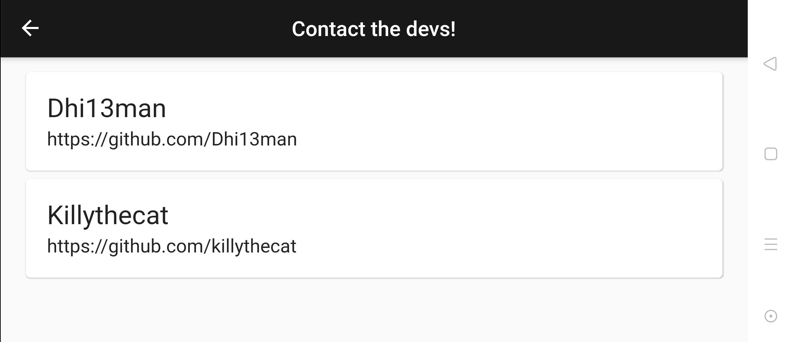

# Doggo Rater:

Get to look at and rate photos of random Dogs from all over the internet.

## ABOUT:

Flutter app that was created by [Dhiman Seal (@dhi13man)](http://www.github.com/dhi13man) and [Aniket Sahu (@KillyTheCat)](http://www.github.com/killythecat), just as an excuse to learn the basics of Flutter, Requests and Futures.  
Uses Dog API: https://dog.ceo/dog-api/

### Screenshots:
<table border=3>
<tr>
<th>

<b>Mobile App [Android, Portrait, Light Mode]:</b>

</th>
<th>

<b>Web App [Chrome, Portrait, Dark Mode]:</b>

</th>
</tr>

<tr>
<td>

</td>
<td>

</td>
</tr>
</table>

<table border=3>
<tr>
<th>

<b>Mobile App [Android, Landscape, Dark Mode]:</b>

</th>
</tr>
<tr>
<td>

</td>
</tr>

<tr>
<th>

<b>Web App Side Bar [Chrome, Landscape, Light Mode]:</b>

</th>
</tr>
<tr>
<td>

</td>
</tr>
<tr>
<th>

<b>Mobile App Contacts Page [Android, Landscape]:</b>

</th>
</tr>
<tr>
<td>

</td>
</tr>
</table>

 
 

# Feel free to make your own contributions to Doggo Rater. ❤
